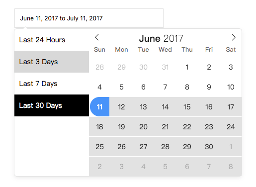

# Flatpickr - ShortcutPickRange

The Plugin for [flatpickr](https://github.com/chmln/flatpickr)



## Usage

```javascript
var dateFrom = "2017-5-1"
var dateTo = "2017-6-1"
var today = new Date(new Date().setHours(0,0,0,0));
var add   = function(num){
  _today = new Date(today);
  result = _today.setDate(_today.getDate() + num);
  return new Date(result);
};
var onChange = function(selectedDates,fp){
  selected = selectedDates.map(
    function(date){ return fp.formatDate(date,"Y-m-d") }
  );
  console.log(selected);
};
var $flatpickr  = $("#flatpickr");

var config = {
  shortcut: [
    { activate: false, text: "Last 24 Hours", range: [add(-1),  today] },
    { activate: false, text: "Last 3 Days",   range: [add(-3),  today] },
    { activate: false, text: "Last 7 Days",   range: [add(-7),  today] },
    { activate: true,  text: "Last 30 Days",  range: [add(-30), today] }
  ],
  onChange: onChange
}

$flatpickr.flatpickr({
  mode: "range",
  altInput: true,
  plugins: [new shortcutPickRangePlugin(config)],
  defaultDate: [dateFrom,dateTo],
})
```
